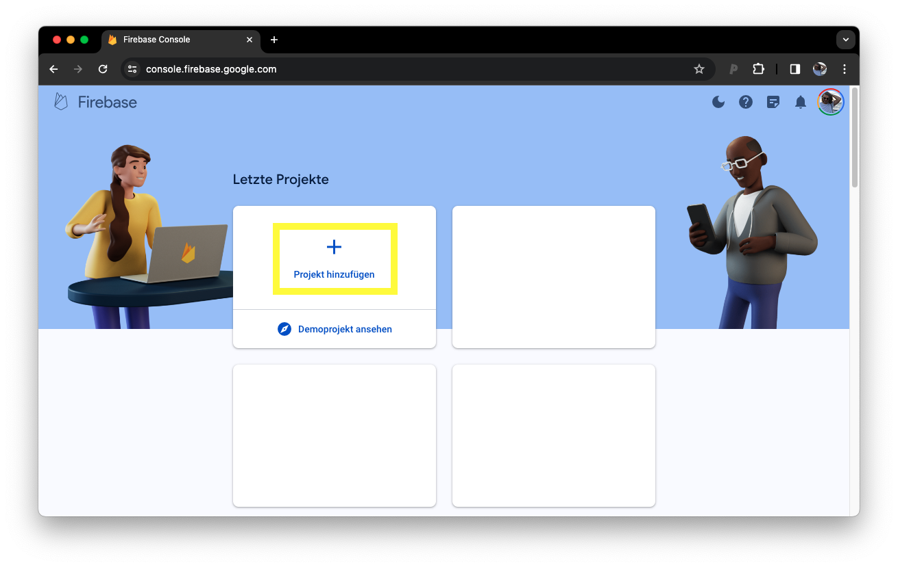
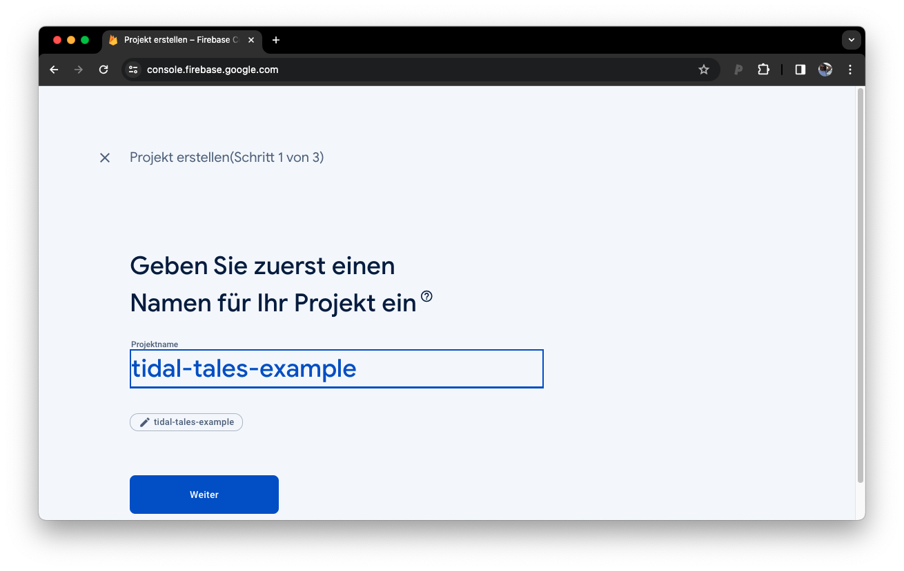
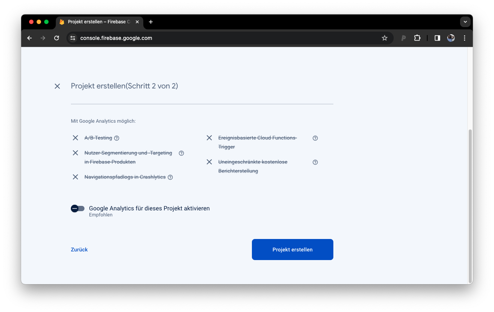

{ align=right style="height:125px;width:125px" }

# Firebase Backend

The Tidal Tales backend runs on [Google Firebase](https://firebase.google.com/). The backend takes care of downloading images and videos just as stories are collected. The [Firefox Plugin](plugin.md) transmits the captured stories in a request to the backend. Each story is added to the database, and each newly created entry triggers the download process. Using *cloud functions* the images and videos are downloaded asynchronously to a *firebase bucket*. 

The backend project is [available on GitHub](https://github.com/michaelachmann/zeeschuimer-firebase-backend). To collect stories you will have to set up your own firebase project and install the scripts, following the manual below.

## Firebase Setup

First of all we need to create a firebase project. Head over to [Google Firebase](https://firebase.google.com/) and sign up. Create a new project and enable the firestore, functions, and storage module through the interface (see screenshots below). 

<figure markdown>
{lazy-loading: true}
  <figcaption>First of all let's create a new project</figcaption>
</figure>

<figure markdown>

  <figcaption>Either create a new project or select an existing google cloud project.</figcaption>
</figure>

<figure markdown>

  <figcaption>Google Analytics is not necessary, let's deactivate it and submit the project.</figcaption>
</figure>

## Installation
**Requirements:**
Make sure to have [nodejs](https://nodejs.org/en) installed.

Install the firebase tools globally:  
`npm install -g firebase-tools`

Clone the project:   
`git clone https://github.com/michaelachmann/zeeschuimer-firebase-backend.git`

Open the directory and install the dependencies   
`cd zeeschuimer-firebase-backend`

`npm install`

`firebase login`

`firebase use --add`

## Use

## Create a Credentials File