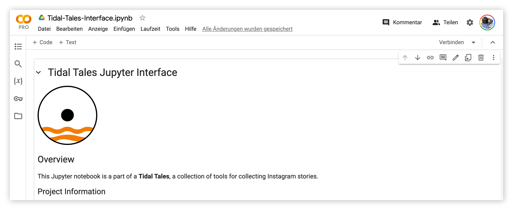

{ align=right style="height:125px;width:125px" }

# Jupyter Interface
The Jupyter Interface is a jupyter notebook that helps with **creating** projects, and the **export** of collected stories. The interface uses a [credential file](backend.md#create-a-credentials-file) to authenticate against the backend. Jupyter notebooks are widely used by data scientists, programmers, and researchers for developing and sharing software code. [Google Colab](http://colab.research.google.com), a cloud-based version of Jupyter notebooks, provides a environment that's accessible through a web browser, without the need for any installation. Our notebooks is designed with form and allows users to interact with the backend by simply hitting 'run' and entering their information. This approach makes it incredibly accessible, even for those who might not be familiar with programming, while still offering the powerful capabilities that professionals need.

!!! example "Future Work"
    This building block of Tidal Tales should be replaced by a web interface. Such an interface would lower the technical requirements to work with tidal tales. 

## Installation
1. Download the notebook from our GitHub repository or 
2. Connect to Colab VM (Hit the top right "connect" button) or start your local jupyter environment and open the notebook.
3. Upload the credential files (e.g. `XXXX-firebase-adminsdk-ZZZ-YYYYY.json`) to your Colab environment or copy the file to the notebook directory when working locally.
 
## Project Creation

Creating a new data collection project using the jupyter interface is straight forward: Enter the filename of your credentials file (e.g. `XXXX-firebase-adminsdk-ZZZ-YYYYY.json`) in the `credentials_path` field. Run the cell using the run button to the left of the cell or using the `CTRL+Enter` / `⌘+Enter` key combination.

Next, enter a name for you project (`project_name`) and optionally an `alert_email`. When activated, alerts are sent if a project did no receive any new stories in more than 12 hours. Hit run and wait for the output: The cell prints a project id and an API key. **These values are important, write them down!**. Both values are needed for configuring the [Plugin](plugin.md).

## Data Export

Once the [Plugin](plugin.md) has been configured and the first stories collected, we can come back to the interface notebook to take a first look at the collected data. Enter the `PROJECT_ID` noted above and run the export cell. Depending on the amount of stories collected, this cell will take a moment to download all entries from the firebase database. Next run the conversion to DataFrame, enter a `df_export_path`, ending in `.csv`. The exported metadata will be saved to this CSV file. Using the `df.head()` command we can take a quick look at the first rows. 

## Media Export

Enter the `storage_bucket` (see [Backend Setup Process](backend.md#firebase-setup)) and run the export cell. One image after another is downloaded to `{media_export_path}/images/{username}/{story_id}.jpg`. Once all images have been downloaded, the video download starts: One video after another is downloaded to `{media_export_path}/videos/{username}/{story_id}.mp4`.

The last line is optional: Compress all media files into a ZIP file for download or archival (e.g. on Google Drive): `!zip -r chose-your-filename.zip media/*`

