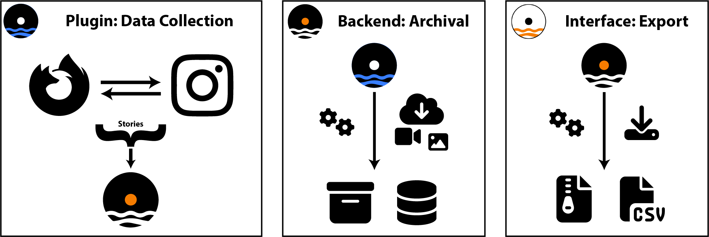

---
hide:
  - navigation
---

{ align=right style="height:125px;width:125px" }

# Welcome to Tidal Tales
Tidal Tales is an innovative suite of tools designed to enable scientific research of Instagram Stories. Just as the tide ebbs and flows with predictable certainty, our project is built on the premise of capturing the transient yet impactful narratives that unfold on Instagram—twice a day, every day. This methodical approach ensures no story is missed, mirroring the natural rhythm of the tides in our quest to archive and analyze digital narratives.

## Workflow: Overview
{ align=center  }

### Get Started

Embark on your research journey with Tidal Tales today. Explore our tools, discover new stories, and uncover the patterns that shape our digital and social worlds. Follow these steps to get started with your data collection: 

1. [Install your own firebase backend instance](getting-started/backend.md). 
2. [Create a new project using the Jupyter Notebook](getting-started/jupyter-interface.md)
3. [Install and Configure the Firefox Plugin](getting-started/plugin.md)
4. Watch Stories
5. [Export the collected data using the Jupyter Notebook](getting-started/jupyter-interface.md)

